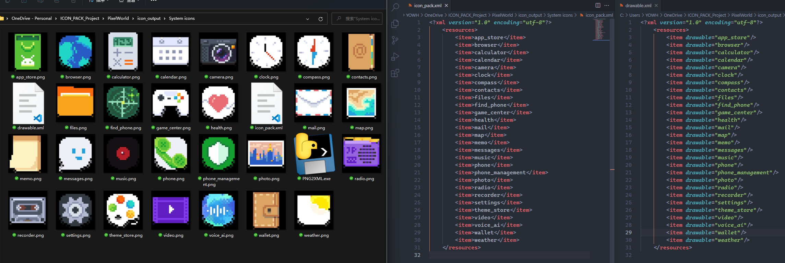

## 图标包工作流批处理脚本 PNG2XML 和 RENAME2

### 废话

原来找的批处理工具是Java编写的`png2xml.jar`，现在用起来发现有时候在PC/Mac上会出现不同的问题。 生成出来的xml是空白的！所以决定自己动手写个批处理脚本。

### PNG2XML & RENAME2 简介

这是一个批处理程序。不需要安装相关的运行环境。
用在图标包制作的工作流中。把其中一项无聊且繁琐的工作自动化。

另一个`RENAME2`是把收到的请求适配图标中 有些会出现中文名称，每次都要修改成英语Pinyin。所以也写了一个自动重命名的批处理。

### PNG2XML 功能
PNG2XML 会把当前文件夹下的`.PNG`格式的图片文件名，分别写入两个`drawable.xml`和`icon_pack.xml`中。

按照图标包中所需要的格式进行。

### RENAME2 功能
RENAME2 会把当前文件夹下的`.xml`格式的文件中自动匹配含有中文字符的值修改为Pinyin.还会导出一个中文名 和 Pinyin名的 `.txt` 方便检查对照和复制。

按照图标包中所需要的格式进行。

- 替换的位置
  - `appfilter.xml`
  - `appmap.xml`
  - `theme_resouces.xml`

- 命名规则和格式

| 中文名      | Pinyin           |
| ----------- | ---------------- |
| 光遇        | guangyu          |
| a_360浏览器 | a_360liulanqi    |
| 北京e点通   | beijingediantong |

### 用法
把 `.exe` 程序 放入需要处理的文件夹中。并双击它。

### 编译
使用 pyinstaller 来编译。
Mac / Linux 下编译出来是 可执行文件（需要终端运行）。
要想编译 Mac app  可以尝试 py2app （未测试）。